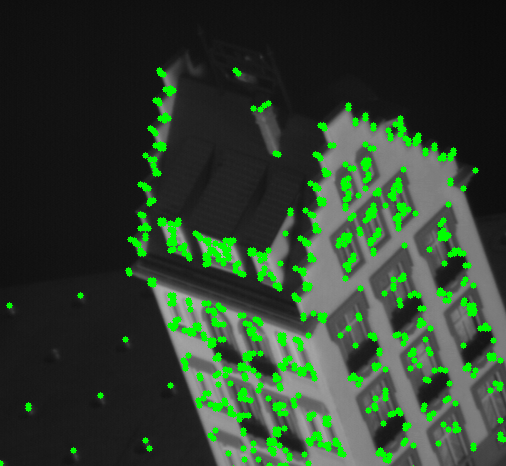

# Kanadae-Lucas-Tomasi-Feature-Tracker
The Kanade-Lucas-Tomasi (KLT) Feature Tracker algorithm estimates the 2D translation and scale changes of an image template between original template coordinates and a given reference image using the Inverse Compositional algorithm. 

## Overview

In the problem, you will implement a corner detector and feature tracker that track features from the image sequence hotel. Since this is a two part problem, we have included precomputed intermediate results in the *Data* section in case you’re unable to complete any portion.


**Note:**  We will not use existing keypoint detectors, trackers, or structure from motion code, such as found on the web, and OpenCV.

## 1.1 Keypoint Selection  
For the first frame, use the second moment matrix to locate strong corners to use as keypoints.
These points will be tracked throughout the sequence in the second part of the problem. Choose a proper threshold so that edges and noisy patches are ignored. Do local non-maxima suppression over a 5x5 window centered at each point.
This should give several hundred good points to track.

## 1.2 Feature Tracking 

Applying the Kanade-Lucas-Tomasi tracking procedure to track the keypoints found in part 1.1 (or the given keypoints in the *Data* section) throughout the hotel sequence. 


Some keypoints will move out of the image frame over the course of the sequence. Discard any track if the predicted translation falls outside the image frame.


Adding codes to **plot** your tracked points overlayed in the **first sequence** and the **last sequence**. They should look similar to the second picture shown in the Overview section. 

## Results

<table>
    <tr>
        <td><p align='center'>Keypoints Detected</p></td>
        <td><p align='center'>All tracked Keypoints</p></td>
    </tr>
    <tr>
        <td><p align='center'>20 Random Keypoints</p></td>
        <td><p align='center'>Outliers</p></td>
    </tr>
</table>

# Folder Structure
```
📦Kanadae-Lucas-Tomasi-Feature-Tracker
 ┣ 📂Results
 ┃ ┣ 📜20_ran_kp.png
 ┃ ┣ 📜all_tracked_kp.png
 ┃ ┣ 📜key_points.png
 ┃ ┗ 📜outliers.png
 ┣ 📜.gitignore
 ┣ 📜KLT_Feature_Tracker.ipynb
 ┣ 📜LICENSE
 ┗ 📜README.md
```